# Guia de Uso del Dashboard HTML

Esta guia explica como navegar y aprovechar el dashboard HTML interactivo generado por Huawei Cloud Security Scanner. El dashboard esta diseñado con un estilo visual inspirado en AWS Service Screener: sidebar oscuro navy con borde dorado, headers colapsables, stat cards coloridas, graficos interactivos, selector de idioma (EN/ES) y colores de severidad estilo Risk Meter.

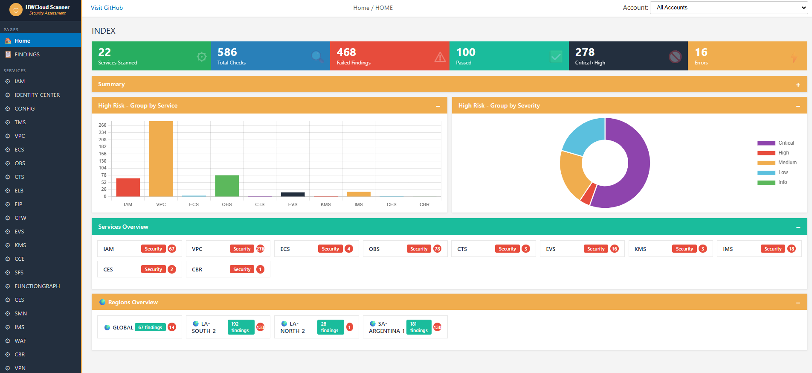

---

## Como Abrir el Dashboard

Despues de ejecutar el scan, el reporte se genera en:

```
output/index.html
```

Abrilo directamente en tu navegador (doble click o arrastrar al browser). No necesita servidor web, funciona como archivo local.

---

## Estructura General

El dashboard tiene 3 zonas principales:

```
+------------------+--------------------------------------------+
|                  |  TOP BAR (hamburguesa, GitHub, Lang, bread) |
|    SIDEBAR       +--------------------------------------------+
|  (navegacion)    |                                            |
|  navy #232f3e    |            CONTENIDO PRINCIPAL              |
|  borde dorado    |         (cambia segun la pagina)            |
|                  |                                            |
+------------------+--------------------------------------------+
```

### Las 3 paginas del dashboard:

| Pagina | Contenido |
|--------|-----------|
| **Home** | Vision ejecutiva: KPIs, graficos, servicios, regiones |
| **Findings** | Tabla completa de hallazgos con filtros avanzados |
| **Service Detail** | Detalle por servicio con recursos y checks individuales |

---

## 1. Sidebar (Panel Izquierdo)

El sidebar navy oscuro (#232f3e) con borde lateral dorado (#f0ad4e) contiene la navegacion principal.

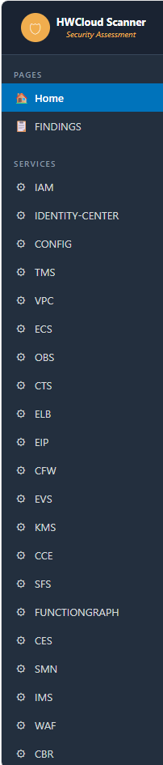

### Secciones del Sidebar

| Seccion | Contenido |
|---------|-----------|
| **Pages** | Home, Findings |
| **Services** | Lista dinamica de servicios escaneados (IAM, VPC, ECS, etc.) |

### Comportamiento

- Click en cualquier item para navegar a esa pagina
- El item activo se resalta en **azul**
- Cuando estas viendo el detalle de un servicio, ese servicio queda **highlighted en azul** en la lista del sidebar
- En mobile/tablet (< 900px): el sidebar se oculta; usar el boton hamburguesa en la top bar para mostrarlo

---

## 2. Top Bar (Barra Superior)

La barra superior se mantiene fija al hacer scroll y contiene multiples elementos:

| Elemento | Posicion | Funcion |
|----------|----------|---------|
| Menu hamburguesa | Izquierda | Abre/cierra el sidebar (siempre visible, util en mobile) |
| "Visit GitHub" | Izquierda | Link externo al repositorio del proyecto |
| Language selector | Derecha | Dropdown EN/ES para cambiar idioma de la interfaz |
| Breadcrumb | Centro | Muestra la pagina actual (ej: "Home / IAM") |
| Account filter | Derecha | Dropdown para filtrar findings por cuenta |

---

## 3. Pagina Home (INDEX)

Es la vista ejecutiva. Muestra el resumen del scan completo.

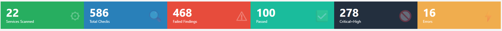

### 3.1 Stat Cards (KPIs)

Fila de 6 tarjetas de colores en la parte superior con metricas clave:

| Card | Que muestra | Color | Clickeable |
|------|-------------|-------|------------|
| Services Scanned | Cantidad de servicios analizados | Verde (#27ae60) | No |
| Total Checks | Total de checks ejecutados (pass + fail) | Azul (#2980b9) | No |
| Failed Findings | Cantidad de hallazgos fallidos | Rojo (#e74c3c) | Si - filtra Findings por status=fail |
| Passed | Checks que pasaron correctamente | Teal (#1abc9c) | Si - filtra Findings por status=pass |
| Critical+High | Suma de hallazgos criticos y altos | Navy (#232f3e) | Si - filtra Findings por critical+high |
| Errors | Checks que dieron error (API no respondio, etc.) | Amarillo (#f0ad4e) | No |

### 3.2 Summary (Resumen de Severidad)

Seccion colapsable con header dorado. Click en el header para expandir/colapsar.

Muestra barras de progreso con el porcentaje de cada severidad usando **colores Risk Meter**:

| Severidad | Color Risk Meter | Significado |
|-----------|-----------------|-------------|
| **Critical** | #cc0000 (rojo oscuro) | Problemas que requieren accion inmediata |
| **High** | #e74c3c (rojo-naranja) | Problemas de alta prioridad |
| **Medium** | #f39c12 (naranja-amarillo) | Riesgo moderado, planificar remediacion |
| **Low** | #8bc34a (amarillo-verde) | Riesgo bajo, mejoras sugeridas |
| **Informational** | #17a2b8 (celeste/cyan) | Solo informativo |

Las barras de severidad son **clickeables**: haciendo click en una barra se navega a Findings filtrado por esa severidad.

### 3.3 Graficos

Dos graficos lado a lado con headers de seccion dorados:

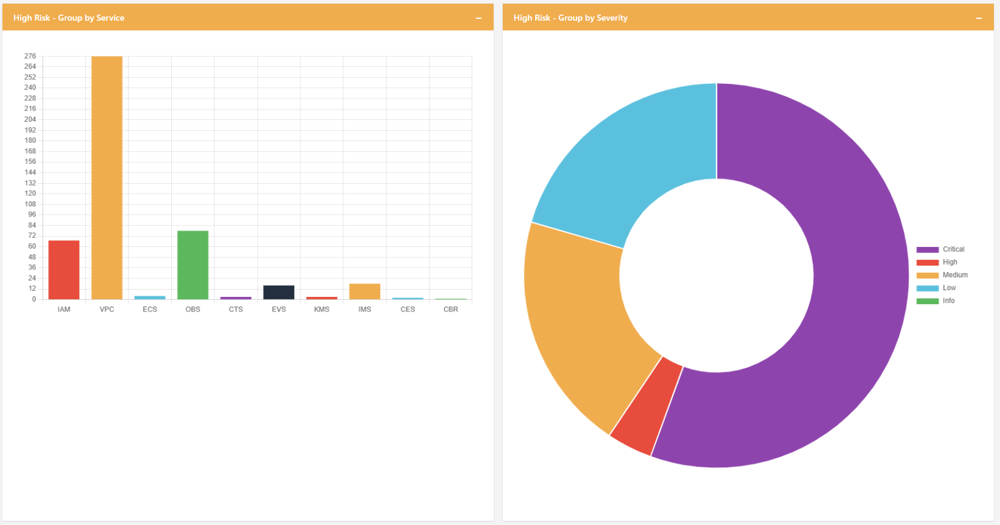

| Grafico | Tipo | Que muestra |
|---------|------|-------------|
| High Risk - Group by Service | Barras (bar chart) | Cantidad de findings fallidos por servicio |
| High Risk - Group by Severity | Doughnut | Distribucion de severidades (solo findings fallidos) |

Los graficos son interactivos: pasar el mouse sobre un segmento muestra el valor exacto.

### 3.4 Services Overview

Seccion colapsable con header **teal**. Muestra un grid de cards clickeables, una por cada servicio escaneado.

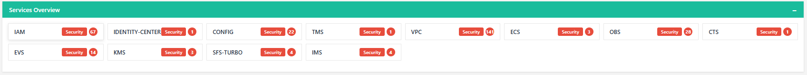

Cada card muestra:
- Nombre del servicio
- Badge "Security" (pillar badge)
- Severity dot con color de la severidad mas alta encontrada

**Click en una card** para navegar a la pagina Findings con ese servicio ya filtrado.

### 3.5 Regions Overview

Seccion colapsable con header **dorado**. Tiene un layout dividido en dos mitades:

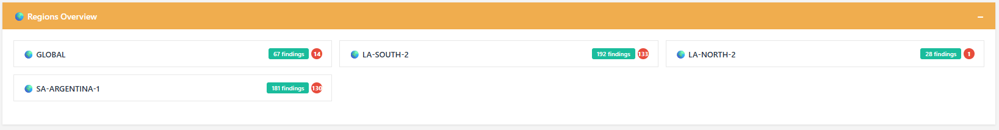

| Mitad | Contenido |
|-------|-----------|
| **Izquierda** | Grid de region cards clickeables (nombre de region + total findings + indicador severidad) |
| **Derecha** | Grafico doughnut mostrando la distribucion de findings por region con colores predefinidos por region |

**Click en una region card** para navegar a la pagina Findings con esa region ya filtrada.

---

## 4. Pagina Findings (Tabla de Hallazgos)

Esta pagina muestra TODOS los hallazgos en una tabla unificada con herramientas avanzadas de filtrado y exportacion.

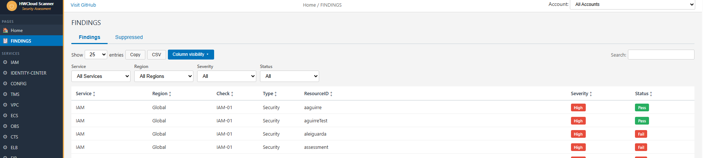

### 4.1 Tabs

| Tab | Contenido |
|-----|-----------|
| **Findings** | Tabla principal de hallazgos activos |
| **Suppressed** | Hallazgos suprimidos |

### 4.2 Toolbar

Arriba de la tabla hay una barra de herramientas:

| Elemento | Funcion |
|----------|---------|
| Show X entries | Selector de cantidad de filas por pagina |
| Copy | Copia la tabla al clipboard |
| CSV | Descarga archivo CSV con los findings filtrados |
| Column visibility | Boton azul que abre dropdown navy para mostrar/ocultar columnas |

### 4.3 Filtros

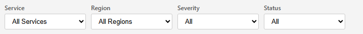

Cuatro filtros combinables arriba de la tabla:

| Filtro | Opciones |
|--------|----------|
| **Service** | Dropdown con todos los servicios escaneados |
| **Region** | Dropdown con todas las regiones detectadas |
| **Severity** | Critical / High / Medium / Low / Informational |
| **Status** | Fail / Pass |

Los filtros se combinan (AND): si seleccionas Service=IAM + Region=la-south-2 + Severity=High, veras solo findings de IAM en la-south-2 con severidad High.

### 4.4 Busqueda

El campo "Search" filtra en tiempo real por cualquier texto visible en la tabla. Escribi cualquier texto y la tabla se actualiza al instante.

### 4.5 Columnas de la Tabla

La tabla tiene **9 columnas**:

| Columna | Que muestra |
|---------|-------------|
| Service | Nombre del servicio (IAM, VPC, RDS...) |
| Region | Region donde se encontro (ej: la-south-2) |
| Check | ID del check (ej: IAM-01, VPC-03) |
| Type | Tipo de hallazgo (Security) |
| ResourceID | Nombre o ID del recurso afectado |
| Current Value | Lo que se encontro (el estado actual del recurso) |
| Recommendation | Que hacer para remediarlo |
| Severity | Badge de color con la severidad |
| Status | Badge de estado (Fail/Pass) |

### 4.6 Ordenamiento

Click en el header de cualquier columna para ordenar:
- Primer click: ascendente (A-Z)
- Segundo click: descendente (Z-A)

### 4.7 Column Visibility (Visibilidad de Columnas)

El boton azul "Column visibility" abre un dropdown con fondo navy listando las 9 columnas:

- Service, Region, Check, Type, ResourceID, Current Value, Recommendation, Severity, Status

**Click en un nombre** para ocultar/mostrar esa columna:
- Texto normal = columna visible
- Texto tachado + opaco = columna oculta

Esto es util para:
- Simplificar la vista cuando todas las findings son del mismo servicio
- Ocultar "Type" (siempre es Security por ahora)
- Exportar un CSV con solo las columnas que necesitas

El menu se cierra automaticamente al hacer click fuera de el.

### 4.8 Exportar

| Boton | Que hace |
|-------|----------|
| **Copy** | Copia la tabla al clipboard (para pegar en Excel) |
| **CSV** | Descarga un archivo CSV con los findings filtrados (respeta columnas visibles) |

---

## 5. Pagina de Detalle por Servicio

Se accede haciendo click en un servicio (desde el sidebar o desde las Service Cards en Home).

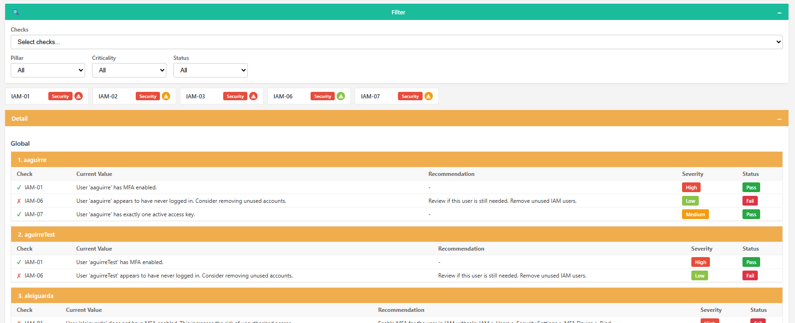

### 5.1 Titulo de Pagina

El titulo muestra el nombre del servicio seleccionado (ej: "IAM", "VPC", "ECS").

### 5.2 Stat Cards del Servicio

Fila de 5 tarjetas especificas del servicio:

| Card | Que muestra |
|------|-------------|
| Resources | Cantidad de recursos evaluados |
| Total Findings | Hallazgos fallidos en este servicio |
| Rules Executed | Checks ejecutados |
| Unique Rules | Checks distintos aplicados |
| Suppressed | Hallazgos suprimidos |

### 5.3 Filtros del Servicio

| Filtro | Funcion |
|--------|---------|
| **Checks** | Dropdown para filtrar por check especifico (ej: solo IAM-01) |
| **Pillar** | Filtro por pilar (Security, Reliability, etc.) |
| **Criticality** | Filtro por severidad |
| **Status** | Filtro por estado: All / Fail / Pass |

### 5.4 Check Cards

Grid de cards mostrando cada check unico del servicio:
- Nombre del check (ej: IAM-01)
- Badge de pilar (ej: "Security")
- Severity dot con color correspondiente

### 5.5 Detail (Vista de Recursos)

La seccion "Detail" muestra los recursos individuales agrupados por region:

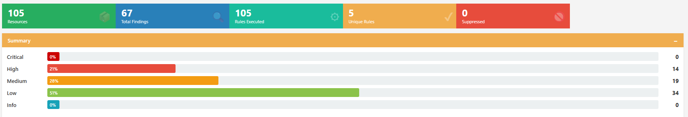

```
la-south-2
  +-----------------------------------------------+
  | 1. nombre-del-recurso            [SERVICIO]   |  <- header dorado
  +-----------------------------------------------+
  | Check  | Current Value | Recommendation | Severity | Status |
  | IAM-01 | MFA disabled  | Enable MFA...  | High     | Fail   |
  | IAM-02 | Key rotated   | -              | Low      | Pass   |
  +-----------------------------------------------+

  +-----------------------------------------------+
  | 2. otro-recurso                  [SERVICIO]   |
  +-----------------------------------------------+
  | ...                                           |
  +-----------------------------------------------+
```

Cada resource card tiene:
- **Header dorado** con el nombre/ID del recurso y badge del servicio
- **Tabla interna de 5 columnas**: Check, Current Value, Recommendation, Severity, Status
- **Iconos de estado**: V verde (pass), X rojo (fail), ! amarillo (warning)
- **Severity**: Badge con color Risk Meter
- **Status**: Badge indicando Fail o Pass

---

## 6. Selector de Idioma (i18n)

El dashboard soporta dos idiomas: Ingles (EN) y Espanol (ES).

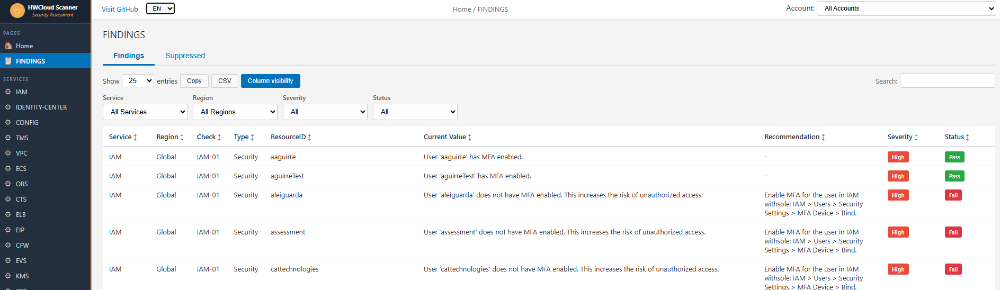

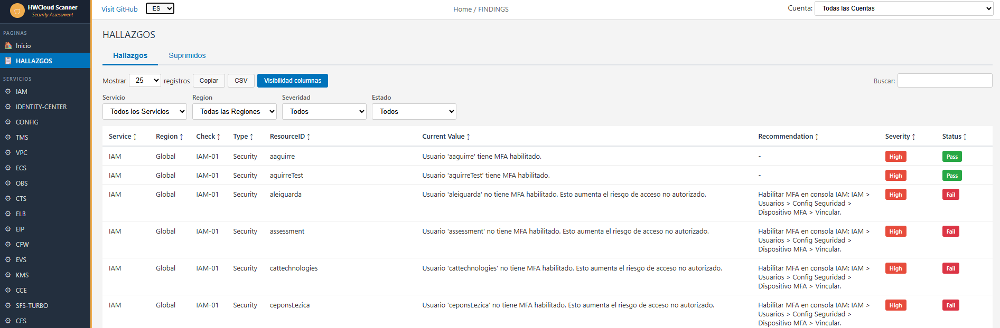

### 6.1 Como cambiar idioma

1. En la top bar, ubicar el dropdown de idioma (muestra "EN" o "ES")
2. Seleccionar el idioma deseado
3. Toda la interfaz se actualiza inmediatamente

### 6.2 Que se traduce

| Elemento | Ejemplo EN | Ejemplo ES |
|----------|-----------|-----------|
| Labels del sidebar | Home, Findings | Inicio, Hallazgos |
| Headers de seccion | Services Overview | Vision de Servicios |
| Labels de stat cards | Services Scanned | Servicios Escaneados |
| Labels de filtros | Service, Region, Severity | Servicio, Region, Severidad |
| Texto de botones | Copy, CSV, Column visibility | Copiar, CSV, Visibilidad de columnas |
| Headers de tabla | Check, ResourceID, Status | Check, RecursoID, Estado |
| Alertas y mensajes | All text in alerts | Todo el texto en alertas |

### 6.3 Traduccion de contenido

El dashboard traduce bidireccionalmente las descripciones y remediaciones:

| Scanners | Idioma original | Traduccion |
|----------|----------------|-----------|
| IAM, VPC, ECS, OBS, CTS, ELB | Ingles | Se traducen al espanol cuando ES esta seleccionado |
| Todos los demas | Espanol | Se traducen al ingles cuando EN esta seleccionado |

El archivo de traducciones es `reports/translations.py` con aproximadamente 230 entradas.

---

## 7. Filtro Rapido (Click en Cards)

Muchos elementos del dashboard son clickeables y navegan directamente a Findings con un filtro pre-aplicado:

| Elemento clickeable | Que filtra |
|---------------------|------------|
| **Service card** (Home > Services Overview) | Findings de ese servicio |
| **Region card** (Home > Regions Overview) | Findings de esa region |
| **Barra de severidad** (Home > Summary) | Findings de esa severidad |
| **Card "Failed Findings"** (stat card roja) | Findings con status = Fail |
| **Card "Passed"** (stat card teal) | Findings con status = Pass |
| **Card "Critical+High"** (stat card navy) | Findings con severidad Critical o High |

### Como funciona

1. Click en cualquiera de estos elementos
2. El dashboard navega automaticamente a la pagina Findings
3. El filtro correspondiente se aplica automaticamente
4. La tabla muestra solo los resultados filtrados

Para volver a ver todo: cambiar los filtros a "All" o hacer click en "Home" en el sidebar.

---

## 8. Secciones Colapsables

Los paneles con header dorado o teal son colapsables:

| Seccion | Color header | Estado por defecto |
|---------|-------------|-------------------|
| Summary | Dorado (#f0ad4e) | Colapsado |
| Charts | Dorado (#f0ad4e) | Expandido |
| Services Overview | Teal (#1abc9c) | Expandido |
| Regions Overview | Dorado (#f0ad4e) | Expandido |

- **Click en el header** para expandir/colapsar
- El icono cambia: `+` (colapsado) / `-` (expandido)

---

## 9. Responsive (Mobile/Tablet)

En pantallas chicas (< 900px):

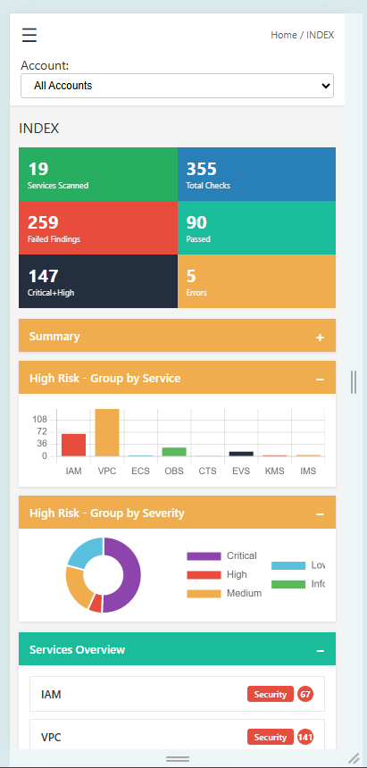

| Elemento | Comportamiento mobile |
|----------|----------------------|
| Sidebar | Se oculta automaticamente |
| Menu hamburguesa | Aparece en la top bar para abrir/cerrar sidebar |
| Stat cards | Se reorganizan en 2 columnas |
| Graficos | Se apilan verticalmente (uno debajo del otro) |
| Check/Service/Region cards | Se muestran en 1 columna |

---

## 10. Colores de Severidad (Risk Meter)

El dashboard usa un esquema de colores estilo "Risk Meter" para las severidades:

| Severidad | Codigo color | Aspecto visual |
|-----------|-------------|----------------|
| Critical | #cc0000 | Rojo oscuro |
| High | #e74c3c | Rojo-naranja |
| Medium | #f39c12 | Naranja-amarillo |
| Low | #8bc34a | Amarillo-verde |
| Informational | #17a2b8 | Celeste/cyan |

Estos colores se usan consistentemente en:
- Barras de severidad (Summary)
- Badges de severidad en tablas
- Severity dots en cards
- Graficos (doughnut y barras)

---

## 11. Interpretacion de Resultados

### Priorizar la remediacion

1. **Empezar por Critical+High** en la pagina Home (card navy clickeable)
2. Ir a Findings, filtrar por Severity = Critical
3. Para cada servicio con findings criticos, entrar al detalle
4. En la vista de recursos, leer las columnas "Current Value" y "Recommendation"

### Flujo recomendado de revision

```
Home (vision ejecutiva)
  |
  v
Findings (filtrar por Critical)
  |
  v
Servicio con mas findings (click en card)
  |
  v
Detail -> ver recurso por recurso -> remediar
  |
  v
Repetir para High, luego Medium
```

### Que significan los KPIs

| Si ves... | Significa... |
|-----------|--------------|
| Failed Findings = 0 | Excelente! No se encontraron problemas |
| Critical+High > 0 | Hay problemas urgentes que atender |
| Errors > 0 | Algunos checks no pudieron ejecutarse (revisar permisos o disponibilidad del servicio) |
| Total Checks alto, Failed bajo | Buena postura de seguridad general |

---

## 12. Exportar para Reportes

### Opcion 1: CSV desde el Dashboard

1. Ir a Findings
2. Aplicar filtros si necesitas un subconjunto
3. Click en "CSV" - se descarga el archivo
4. Abrir en Excel para analisis adicional

### Opcion 2: Copiar tabla

1. Ir a Findings
2. Click en "Copy"
3. Pegar en Excel, Google Sheets, o un mail

### Opcion 3: Imprimir / PDF

1. En el navegador: Ctrl+P
2. Seleccionar "Guardar como PDF"
3. Recomendacion: estar en la pagina que quieras imprimir

---

## 13. Tips y Trucos

| Tip | Descripcion |
|-----|-------------|
| Busqueda rapida | En Findings, escribir el nombre del recurso en Search |
| Comparar regiones | En Home, usar la seccion Regions Overview para ver distribucion |
| Foco en un check | En la vista de servicio, usar el filtro Checks para aislar un check |
| Filtro de Status | En Service Detail, usar el filtro Status para ver solo Pass o Fail |
| Multi-account | Usar el dropdown de Account en la top bar para ver una cuenta a la vez |
| Cambiar idioma | Usar el dropdown EN/ES en la top bar para alternar idioma completo |
| Compartir reporte | El HTML es un solo archivo - se puede enviar por mail o Slack |
| Offline | Funciona sin internet (Chart.js se carga desde CDN, pero los datos son locales) |
| Column visibility | Ocultar columnas innecesarias para un CSV mas limpio |

---

## 14. Limitaciones Conocidas

- El archivo HTML puede ser grande si hay muchos findings (> 5000 recursos)
- Chart.js se carga desde CDN; sin internet los graficos no se renderizan (los datos y tablas si funcionan)
- La traduccion cubre ~230 entradas; textos no mapeados se muestran en su idioma original
- El filtro de Account es util solo en escaneos multi-cuenta

---

## 15. Troubleshooting del Dashboard

| Problema | Solucion |
|----------|----------|
| Graficos no aparecen | Verificar conexion a internet (Chart.js CDN) |
| HTML en blanco | Verificar que el scan haya generado findings (revisar output/) |
| Tabla vacia | Verificar filtros activos; resetear seleccionando "All" en cada filtro |
| Sidebar no aparece (mobile) | Click en el icono hamburguesa arriba a la izquierda |
| CSV con caracteres raros | Abrir con encoding UTF-8 en Excel (Datos > Desde texto) |
| Idioma no cambia | Recargar la pagina y volver a seleccionar EN o ES |
| Doughnut de regiones vacio | Verificar que existan findings en mas de una region |
| Filtro Status no funciona en Service Detail | Verificar que haya findings con ambos estados (Pass y Fail) |

---

## Imagenes del Dashboard

Las imagenes de esta guia se encuentran en `docs/images/`. Para generarlas:

1. Ejecutar un scan: `python main.py scan --no-verify-ssl`
2. Abrir `output/index.html` en el navegador
3. Tomar los siguientes screenshots y guardarlos con estos nombres exactos

> **IMPORTANTE**: Todas las capturas deben retomarse porque el diseño del dashboard cambio significativamente (se agregaron colores Risk Meter, selector de idioma, columnas nuevas en tablas, doughnut de regiones, etc.)

### Lista completa de imagenes requeridas

| # | Archivo | Que capturar | Seccion de la guia |
|---|---------|--------------|-------------------|
| 1 | `dashboard-home-full.png` | Pagina Home completa: sidebar navy con borde dorado, top bar con selector de idioma, stat cards, graficos, services overview, regions overview con doughnut | Portada + Seccion 3 |
| 2 | `dashboard-sidebar.png` | Solo el sidebar navy con borde dorado: mostrando Pages (Home, Findings) y Services (lista de servicios con uno highlighted en azul) | Seccion 1 |
| 3 | `dashboard-home-kpis.png` | Stat cards (6 colores: verde, azul, rojo, teal, navy, amarillo) + seccion Summary expandida mostrando barras de severidad con colores Risk Meter | Seccion 3.1 y 3.2 |
| 4 | `dashboard-home-charts.png` | Ambos graficos: bar chart "High Risk - Group by Service" + doughnut "High Risk - Group by Severity" con headers dorados | Seccion 3.3 |
| 5 | `dashboard-home-services.png` | Grid de Service cards con badges Security y severity dots (seccion teal "Services Overview") | Seccion 3.4 |
| 6 | `dashboard-home-regions.png` | Regions Overview completo: mitad izquierda con region cards clickeables + mitad derecha con grafico doughnut de distribucion por region | Seccion 3.5 |
| 7 | `dashboard-findings-table.png` | Pagina Findings: tabs (Findings/Suppressed), toolbar (Show entries, Copy, CSV, Column visibility azul), filtros y tabla mostrando las 9 columnas incluyendo Current Value y Recommendation | Seccion 4 |
| 8 | `dashboard-findings-filters.png` | Detalle de los 4 filtros (Service, Region, Severity, Status) y campo Search con datos visibles | Seccion 4.3 y 4.4 |
| 9 | `dashboard-service-detail.png` | Vista detalle de un servicio: stat cards (5) + filtros (Checks, Pillar, Criticality, Status) + check cards grid con pillar badges y severity dots | Seccion 5 |
| 10 | `dashboard-service-resources.png` | Seccion Detail: resource cards con header dorado, badge de servicio, tabla interna de 5 columnas (Check, Current Value, Recommendation, Severity, Status) | Seccion 5.5 |
| 11 | `dashboard-language-en.png` | Dashboard en modo ingles: top bar mostrando "EN" seleccionado, labels en ingles (Services Scanned, Total Checks, etc.) | Seccion 6 |
| 12 | `dashboard-language-es.png` | Misma vista en modo espanol: top bar mostrando "ES" seleccionado, labels en espanol (Servicios Escaneados, Total de Checks, etc.) | Seccion 6 |
| 13 | `dashboard-mobile.png` | Vista mobile (375px width): sidebar oculto, stat cards en 2 columnas, graficos apilados, cards en 1 columna | Seccion 9 |

### Tips para los screenshots

- **Chrome**: F12 > "Toggle device toolbar" para simular mobile (375x812 para imagen 13)
- **Resolucion recomendada**: 1920x1080 para desktop, 375x812 para mobile
- **Formato**: PNG, ancho maximo ~1200px para que se vean bien en GitHub
- **Recortar**: eliminar bordes del navegador, mostrar solo el contenido
- **Idioma**: para las imagenes 11 y 12, tomar el mismo sector del dashboard cambiando solo el idioma

### Paleta visual del dashboard

| Elemento | Color | Hex |
|----------|-------|-----|
| Sidebar fondo | Navy | #232f3e |
| Sidebar borde | Dorado | #f0ad4e |
| Section headers (tipo 1) | Dorado | #f0ad4e |
| Section headers (tipo 2) | Teal | #1abc9c |
| Stat card - Services | Verde | #27ae60 |
| Stat card - Total Checks | Azul | #2980b9 |
| Stat card - Failed | Rojo | #e74c3c |
| Stat card - Passed | Teal | #1abc9c |
| Stat card - Critical+High | Navy | #232f3e |
| Stat card - Errors | Amarillo | #f0ad4e |
| Severity - Critical | Rojo oscuro | #cc0000 |
| Severity - High | Rojo-naranja | #e74c3c |
| Severity - Medium | Naranja-amarillo | #f39c12 |
| Severity - Low | Amarillo-verde | #8bc34a |
| Severity - Informational | Celeste | #17a2b8 |
| Column visibility boton | Azul | (azul) |
| Column visibility dropdown | Navy | #232f3e |
